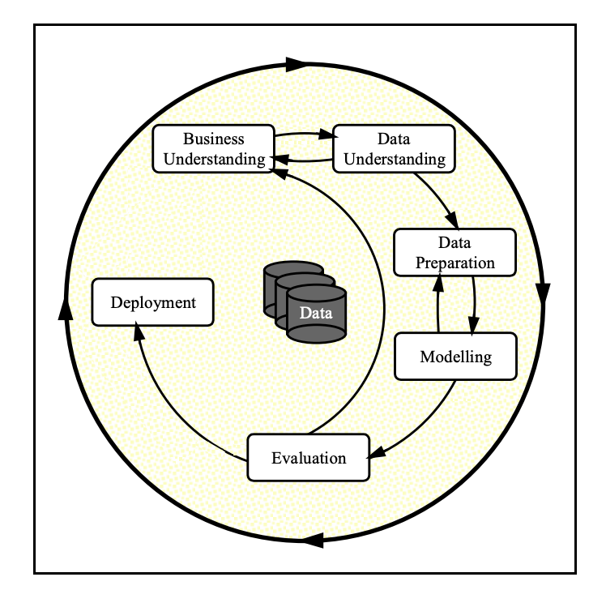

# Used Car Price Analysis

A machine learning project analyzing what drives used car prices in the US, built as part of the UC Berkeley Professional Certificate in ML/AI program. The goal was to identify the factors that most influence resale price and deliver a model useful enough for dealers to benchmark their inventory.

---

## Methodology

I followed the CRISP-DM process throughout:



The dataset came from Kaggle (~426K rows), cleaned down to around **151,436 usable records** after removing duplicates, nulls, extreme outliers, and listings with high prices.

---

## Model Selection

The short version: I tried four different model types before settling on plain Linear Regression as the recommended baseline.

**Linear Regression** was the starting point — no regularization, all features, straightforward. It actually performed the best in terms of raw error (~$4,100 MAE), which was a bit surprising. It does occasionally produce weird edge-case predictions on unusual vehicles, but on average it holds up well.

**Ridge Regression** was the next step, adding L2 regularization to penalize large coefficients. I also paired it with Sequential Feature Selection to trim down the feature set. The idea was that removing noise would improve accuracy, but it did not do that to the extent I expected. Ridge came in around $4,500 MAE, slightly worse than plain LR. It was more stable with rare manufacturer categories and less prone to blowing up on edge cases, but the accuracy tradeoff wasn't worth it for the main use case.

**Lasso Regression** takes the regularization further - it actually zeros out coefficients it doesn't need, which makes the model smaller and more interpretable. That's useful if you want to understand *which* features matter most. But again, the error went up (~$4,900 MAE). Lasso's strength is explanation, not raw prediction accuracy for this dataset.

**Polynomial features** were explored briefly — the idea being that the relationship between year/mileage and price might be non-linear (e.g., mileage impact accelerates past 100K). In practice, adding polynomial terms ballooned the feature space considerably and didn't produce a meaningful improvement over the log-transformed linear model. Given the added complexity and longer training time, it wasn't worth it. I actually ran degree=3, 4, 5 as well on trials but the MSE and MAE went up with degree=3 and then came back down and settled (but still twice as high as LR)

In the end, the log-transformed Linear Regression with all features was the most accurate. The regularized models are still included in the notebook — they're more principled statistically and would likely be the better choice with more data or a noisier dataset.

---

## Key Findings

**Year and mileage dominate everything else.** A newer car with fewer miles will almost always price higher — and the gap is larger than most other factors combined. Beyond that:

- **Brand matters** — Luxury brands (Porsche, Lexus, Audi) and RAM trucks hold value strongly. Some manufacturers drag prices down noticeably
- **8-cylinder engines** price higher on average than 4-cylinder (likely driven by trucks and performance vehicles in that group)
- **EVs and hybrids** carry a consistent premium, more pronounced in coastal markets
- **4WD and RWD** vehicles price above FWD overall — probably reflects the truck/SUV composition more than drive type itself
- **Condition** matters but has less impact than an extra year of age or 30,000 miles
- **State-level pricing** varies — Hawaii and coastal states show higher averages, though this is hard to separate from cost-of-living differences

### Average Price by State

The regional price breakdown is available as an interactive choropleth map. Open it locally in a browser:

[`images/avg_price_by_state.html`](images/avg_price_by_state.html)

---

## Model Results

Three regression models were evaluated:

| Model | Avg Error (MAE) | Notes |
|-------|----------------|-------|
| Linear Regression (all features) | ~$4,100 | Simplest; occasional edge-case predictions |
| Ridge Regression + Feature Selection | ~$4,500 | More stable, handles rare categories better |
| Lasso Regression + Feature Selection | ~$4,900 | Most interpretable; auto-drops weak features |

Models were trained on 70% of data, validated on 30%. Prices were log-transformed during training to handle the right-skewed distribution and prevent negative predictions.

The full analysis is in [`notebooks/00 data analysis and model selection.ipynb`](notebooks/00%20data%20analysis%20and%20model%20selection.ipynb).

---

## Data Enrichment — NHTSA vPIC (VIN Decoding)

As part of the data enrichment phase, I built a local VIN decoding service backed by the **NHTSA vPIC PostgreSQL database** with the help of AI coding assistant. The service runs via Docker, initially thought about for batch VIN lookups but ultimately connected directly to PG SQL for faster implementation.

> **Note on AI coding assistance**: The `services/vin-api` service was predaominantly setup with the help of AI coding tools (Claude). The architecture, FastAPI wrappers, Docker Compose setup, and database initialization scripts were largely AI-assisted. The service itself functions correctly for VIN decoding.

**However, the enriched fields I attempted to extract — specifically transmission type and base MSRP — were ultimately dropped from the analysis.** The VIN data in the listing was too sparse and inconsistently formatted to yield usable fill rates. Enough rows came back empty or ambiguous that including these fields would have introduced more noise than signal.

**The NHTSA vPIC database will be picked up again in future analysis.** It's well-suited for adding trim-level data, engine displacement, GVWR, and other spec-level attributes that weren't practical to derive from Craigslist listings alone. Those features could meaningfully improve model accuracy in a follow-up study.

See [`services/vin-api/README.md`](services/vin-api/README.md) for setup and usage details.

Source: [NHTSA Product Information Catalog and Vehicle Listing](https://vpic.nhtsa.dot.gov/downloads/)
---

## Project Structure

```
ucb-used-car-analysis/
├── notebooks/
│   └── 00 data analysis and model selection.ipynb   # Main analysis notebook
├── data/
│   ├── vehicles.csv                                 # Raw kaggle dataset
│   └── vehicles_enriched.csv                        # After VIN enrichment attempt
├── images/                                          # folder to store all images from analysis
│   ├── avg_price_by_state.html                      # Interactive choropleth — avg price by state
├── services/
│   └── vin-api/                                     # NHTSA VIN decoder (Docker + FastAPI)
│       ├── app/                                     # FastAPI application
│       ├── docker-compose.yml
│       ├── enrich_vehicles_pg.py                    # Batch enrichment script, direct to pg sql
│       └── README.md
├── docs/
│   ├── setup.md                                     # Environment setup guide
└── src/
    └── setup.py
```

---

## Getting Started

**[Setup Instructions](docs/setup.md)** — covers Python environment, dependencies, and JupyterLab setup.

To run the main analysis, open the notebook in JupyterLab:

```bash
jupyter lab "notebooks/00 data analysis and model selection.ipynb"
```

The VIN API service is optional and not required to run the main analysis. If you want to experiment with VIN decoding, see [`services/vin-api/README.md`](services/vin-api/README.md).
